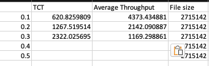

# project_573
Name: Pinxiang Wang \
Unity ID: pwang25 \

How to run:
Direct run those two command under the project directory: \
[To start client] python auc_client.py HOST_IP PORT
[To start server] python auc_server.py PORT
Command to Run the server: \

Command to Run the client: \

Server console sample output （ One round）:

Server console sample for holding next round (First round end, holding next round):

Seller Console sample output:

Buyer Console sample output:

# project_573 part 2
Name: Pinxiang Wang \ Mengzhe Wang

[How to run]
Running on Mac OS: \
all biding operations are the same as part 1. \
The command to start the 'client' should add to parameters: CLIENT_PORT, PACKET_LOSS  \

[Potential issues when running the code]

Due to thread global resource synchronization problems, if you meet these errors, please just restart the server and client. \

[Measurements]
File size: 2.7MB \
The experiment time is too long for packet_loss rate over 0.3. So we only test packet_loss rate from 0.0 to 0.3. \

